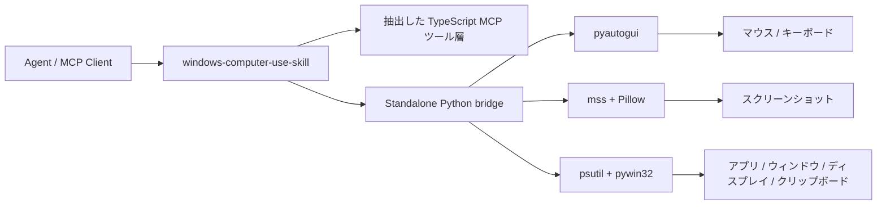

<div align="center">
  
  <h1>Windows Computer-Use Skill</h1>
  <p><strong>Windows 向けのトップレベル skill。standalone runtime と MCP server を同梱しています。</strong></p>
  <p>
    <a href="https://github.com/wimi321/windows-computer-use-skill">GitHub</a>
    ·
    <a href="https://clawhub.ai/wimi321/computer-use-windows">ClawHub</a>
    ·
    <a href="./README.md">English</a>
    ·
    <a href="./README.zh-CN.md">简体中文</a>
  </p>
</div>

## ClawHub からインストール

この skill は ClawHub に [`computer-use-windows`](https://clawhub.ai/wimi321/computer-use-windows) として公開済みです。

```bash
clawhub install computer-use-windows
```

## このプロジェクトの位置づけ

このリポジトリは同時に:

- トップレベルの `skill`
- 独立した Windows デスクトップ制御 runtime
- agent エコシステム向けの computer-use MCP server

として設計されています。Claude のローカルインストールには依存しません。

## このプロジェクトの目的

目標は次のとおりです。

- ローカル Claude に依存しない
- private な `.node` バイナリに依存しない
- 抽出済みの隠し資産に依存しない
- skill を入れて server を build すれば、そのまま使える

## できること

- トップレベル Windows computer-use skill
- スクリーンショット、マウス、キーボード、アプリ起動、ウィンドウ/ディスプレイ対応付け、クリップボードを扱う standalone MCP server
- 公開依存のみ: `Node.js + Python + pyautogui + mss + Pillow + psutil + pywin32`
- 初回起動時に virtualenv を自動作成し、Python 依存を自動導入
- `~/.codex/skills/computer-use-windows/project` に本体まで配置される skill install
- 抽出した TypeScript tool layer を Windows-native Python backend に接続

## 現在の状態

このリポジトリで実装済み:

- Windows Python helper と runtime bootstrap
- ディスプレイ列挙とスクリーンショット経路
- マウス、キーボード、ドラッグ、スクロール、クリップボード
- 最前面アプリ、ポインタ下アプリ、実行中アプリ、インストール済みアプリ、ウィンドウ表示先ディスプレイの取得
- Windows skill packaging と bundled project payload
- TypeScript build 成功

本番投入前に推奨されること:

- 実機 Windows での検証
- UAC、管理者権限ウィンドウ、secure desktop、マルチモニタ拡大率、フォーカス境界の確認

このセッションには実際の Windows マシンが接続されていないため、ここでの状態は「実装済み・build 済み」であり、「Windows 実機で end-to-end 検証済み」ではありません。

## 0.1.1 で修正したこと

`0.1.1` では、Windows 向けパッケージング移行時に壊れていた共有 system-key blocklist の分岐を修正しました。誤ったプラットフォーム分岐により、Windows で OS レベルのショートカット判定に間違った denylist が使われる可能性がありました。

現在は正しい `win32` 分岐に戻してあり、この修正はソース本体と bundled skill payload の両方に同期されています。

## アーキテクチャ



## インストール

### 1. クローンして Node 依存を入れる

```bash
git clone https://github.com/wimi321/windows-computer-use-skill.git
cd windows-computer-use-skill
npm install
npm run build
```

### 2. サーバーを起動

```bash
node dist/cli.js
```

初回起動時に自動で以下を実行します。

- `.runtime/venv` の作成
- 必要なら `pip` の bootstrap
- `runtime/requirements.txt` に基づく Python 依存の導入

## MCP 設定

```json
{
  "mcpServers": {
    "computer-use": {
      "command": "node",
      "args": [
        "C:/absolute/path/to/windows-computer-use-skill/dist/cli.js"
      ],
      "env": {
        "CLAUDE_COMPUTER_USE_DEBUG": "0",
        "CLAUDE_COMPUTER_USE_COORDINATE_MODE": "pixels"
      }
    }
  }
}
```

参考: [`examples/mcp-config.json`](./examples/mcp-config.json)

## Skill インストール

同梱 skill: [`skill/computer-use-windows`](./skill/computer-use-windows)

### Option A: ClawHub からインストール

```bash
clawhub install computer-use-windows
```

### PowerShell

```powershell
powershell -ExecutionPolicy Bypass -File .\skill\computer-use-windows\scripts\install.ps1
```

### Bash

```bash
bash skill/computer-use-windows/scripts/install.sh
```

インストール後の bundled project 既定パス:

```text
%USERPROFILE%\.codex\skills\computer-use-windows\project
```

`CODEX_HOME` が設定されている場合はその配下を使います。

## 検証マトリクス

このセッションで完了したもの:

- `npm run check`
- `npm run build`
- `runtime/windows_helper.py` の Python compile check
- bundled skill ソース整合性チェック
- bundled project の version sync チェック
- Windows runtime における screenshot / clipboard / frontmost app / app enumeration / window-display lookup 経路のコードレビュー

このセッションでは未実施:

- 実機 Windows での GUI 制御
- 実機 Windows での screenshot capture
- 実アプリに対する foreground-window gating
- UAC / 管理者ウィンドウ遷移
- mixed-DPI マルチモニタ検証

## 実行メモ

### 権限

Windows は macOS のような Accessibility / Screen Recording ダイアログはありませんが、次の条件で制限されることがあります。

- agent 側が非管理者で、対象ウィンドウが管理者権限
- UAC secure desktop
- セッション / Remote Desktop 境界
- アプリ独自の anti-automation 制限

### Screenshot Filtering

この runtime は `screenshotFiltering: none` を返します。

つまり screenshot filtering は compositor-native ではなく、gating は MCP レイヤーで行われます。

### 対応プラットフォーム

この実装は現在 `Windows-only` です。

## リポジトリ構成

```text
src/
  computer-use/
    executor.ts
    hostAdapter.ts
    pythonBridge.ts
  vendor/computer-use-mcp/
runtime/
  windows_helper.py
  requirements.txt
skill/
  computer-use-windows/
examples/
assets/
```

## Roadmap

- 実機 Windows での検証とハードニング
- Windows 向け app identity / icon 抽出の改善
- 自動 Windows integration test の追加
- 配布しやすい release artifact の整備

## License

MIT

## Credits

Claude Code computer-use ワークフローから再利用可能な TypeScript ロジックを抽出し、そこに完全独立の公開 Windows runtime を接続したプロジェクトです。
