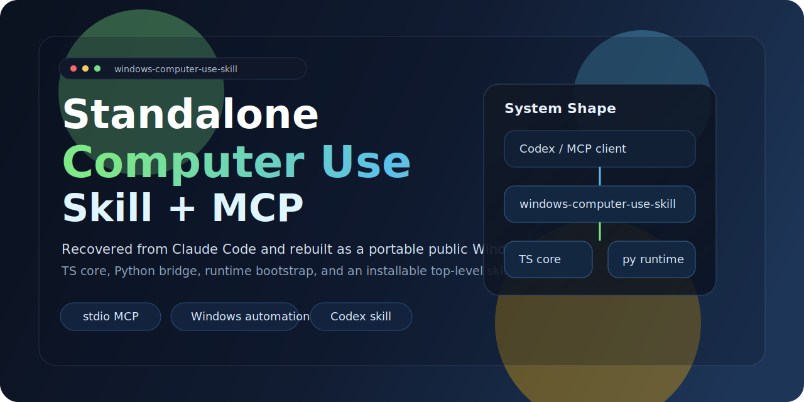
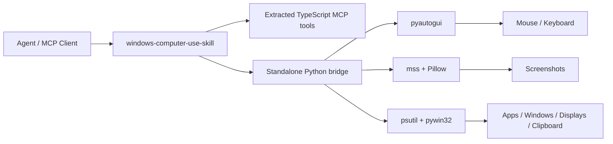

<div align="center">
  
  <h1>Windows Computer-Use Skill</h1>
  <p><strong>A top-level Windows skill with a bundled standalone runtime and MCP server.</strong></p>
  <p>
    <a href="https://github.com/wimi321/windows-computer-use-skill">GitHub</a>
    ·
    <a href="https://clawhub.ai/wimi321/computer-use-windows">ClawHub</a>
    ·
    <a href="./README.zh-CN.md">简体中文</a>
    ·
    <a href="./README.ja.md">日本語</a>
  </p>
</div>

## Install From ClawHub

Published on ClawHub as [`computer-use-windows`](https://clawhub.ai/wimi321/computer-use-windows).

```bash
clawhub install computer-use-windows
```

## Positioning

This repository is:

- a top-level `skill`
- a standalone Windows desktop-control runtime
- a computer-use MCP server for agent ecosystems

It is packaged skill-first, not Claude-first, so the same runtime can be adapted for multiple agent products.

## Why This Exists

The requirement is stricter than "wrap an existing install":

- no dependency on a local Claude app
- no private `.node` binaries
- no extracted hidden assets
- install the skill, build the server, and use it

This project follows that rule on Windows.

## What You Get

- top-level Windows computer-use skill
- standalone MCP server for screenshots, mouse, keyboard, app launch, window/display mapping, and clipboard
- public dependency chain only: `Node.js + Python + pyautogui + mss + Pillow + psutil + pywin32`
- first-run runtime bootstrap: the server creates its own virtualenv and installs dependencies automatically
- bundled skill install that copies the full project into `~/.codex/skills/computer-use-windows/project`
- extracted TypeScript tool layer wired to a Windows-native Python backend

## Status

Implemented in this repository:

- Windows Python helper and runtime bootstrap
- display enumeration and screenshot pipeline
- mouse, keyboard, drag, scroll, and clipboard primitives
- frontmost app, app-under-point, running app, installed app, and window-display lookup paths
- Windows-first skill packaging and bundled project payload
- TypeScript build passing

Still recommended before production use:

- validate on a real Windows host
- exercise UAC, elevated apps, secure desktop, multi-monitor scaling, and focus edge cases

This session did not have a live Windows machine attached, so runtime behavior on Windows has been implemented but not end-to-end verified here.

## What Was Fixed In 0.1.1

Version `0.1.1` fixes a Windows packaging regression in the shared system-key blocklist logic. The migrated file had a broken platform branch that could apply the wrong denylist when checking OS-level shortcuts.

That logic now uses the correct `win32` blocklist again, and the fix has been synced into both the source tree and the bundled skill payload.

## Architecture



## Install

### 1. Clone and install Node deps

```bash
git clone https://github.com/wimi321/windows-computer-use-skill.git
cd windows-computer-use-skill
npm install
npm run build
```

### 2. Start the server

```bash
node dist/cli.js
```

On first launch, the project will automatically:

- create `.runtime/venv`
- bootstrap `pip` if needed
- install the Python runtime dependencies from `runtime/requirements.txt`

## MCP Configuration

```json
{
  "mcpServers": {
    "computer-use": {
      "command": "node",
      "args": [
        "C:/absolute/path/to/windows-computer-use-skill/dist/cli.js"
      ],
      "env": {
        "CLAUDE_COMPUTER_USE_DEBUG": "0",
        "CLAUDE_COMPUTER_USE_COORDINATE_MODE": "pixels"
      }
    }
  }
}
```

See [`examples/mcp-config.json`](./examples/mcp-config.json).

## Skill Install

This repo ships a top-level skill at [`skill/computer-use-windows`](./skill/computer-use-windows).

### Option A: Install from ClawHub

```bash
clawhub install computer-use-windows
```

### PowerShell

```powershell
powershell -ExecutionPolicy Bypass -File .\skill\computer-use-windows\scripts\install.ps1
```

### Bash

```bash
bash skill/computer-use-windows/scripts/install.sh
```

After installation, the bundled project lives at:

```text
%USERPROFILE%\.codex\skills\computer-use-windows\project
```

If `CODEX_HOME` is set, use that location instead.

## Validation Matrix

Validated in this session:

- `npm run check`
- `npm run build`
- Python syntax compile check for `runtime/windows_helper.py`
- bundled skill source integrity checks
- bundled project version sync checks
- review of Windows-specific runtime paths for screenshots, clipboard, frontmost app, app enumeration, and window/display lookup

Not yet validated in this session:

- real Windows GUI control
- live screenshot capture on Windows
- foreground-window enforcement against real Windows apps
- UAC / admin-window transitions
- mixed-DPI multi-monitor behavior

## Runtime Notes

### Permissions

Windows does not require the same Accessibility / Screen Recording prompts as macOS, but desktop control can still be limited by:

- elevated windows when the agent is not elevated
- UAC secure desktop transitions
- session / remote desktop boundaries
- app-specific anti-automation protections

### Screenshot Filtering

This standalone runtime reports `screenshotFiltering: none`.

That means screenshot filtering is not compositor-native; gating still happens at the MCP layer.

### Platform Scope

This repository is intentionally `Windows-only`.

Covered capabilities:

- screenshots
- mouse control
- keyboard input
- frontmost app inspection
- installed / running app discovery
- window-to-display mapping
- clipboard access
- app launch

## Example Commands

```bash
npm run build
node dist/cli.js
```

```bash
node --input-type=module -e "import { callPythonHelper } from './dist/computer-use/pythonBridge.js'; console.log(await callPythonHelper('list_displays', {}));"
```

## Repository Layout

```text
src/
  computer-use/
    executor.ts
    hostAdapter.ts
    pythonBridge.ts
  vendor/computer-use-mcp/
runtime/
  windows_helper.py
  requirements.txt
skill/
  computer-use-windows/
examples/
assets/
```

## Environment Flags

- `CLAUDE_COMPUTER_USE_DEBUG=1`
- `CLAUDE_COMPUTER_USE_COORDINATE_MODE=pixels`
- `CLAUDE_COMPUTER_USE_CLIPBOARD_PASTE=1`
- `CLAUDE_COMPUTER_USE_MOUSE_ANIMATION=1`
- `CLAUDE_COMPUTER_USE_HIDE_BEFORE_ACTION=0`

## Roadmap

- validate and harden on real Windows hardware
- improve app identity and icon extraction on Windows
- add automated Windows integration tests
- publish signed release artifacts for easier distribution

## License

MIT

## Credits

This project preserves and adapts reusable TypeScript computer-use logic recovered from the Claude Code workflow, then replaces the missing private runtime with a fully standalone public Windows implementation.
