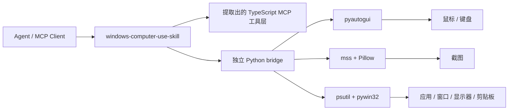

<div align="center">
  
  <h1>Windows Computer-Use Skill</h1>
  <p><strong>一个面向 Windows 的顶级 skill，内置独立 runtime 与 MCP server。</strong></p>
  <p>
    <a href="https://github.com/wimi321/windows-computer-use-skill">GitHub</a>
    ·
    <a href="./README.md">English</a>
    ·
    <a href="./README.ja.md">日本語</a>
  </p>
</div>

## 项目定位

这个仓库同时是：

- 一个顶级 `skill`
- 一套独立的 Windows 桌面控制 runtime
- 一个给 agent 生态使用的 computer-use MCP server

它是 skill-first，不依赖 Claude 本机安装。

## 这个项目解决什么问题

目标仍然是：

- 不依赖本机 Claude
- 不依赖私有 `.node` 二进制
- 不依赖提取内部隐藏资产
- skill 装上、server 构建好，就能直接用

## 你现在拿到的能力

- 顶级 Windows computer-use skill
- 独立 MCP server：截图、鼠标、键盘、应用启动、窗口/显示器映射、剪贴板
- 只使用公开依赖：`Node.js + Python + pyautogui + mss + Pillow + psutil + pywin32`
- 首次运行自动自举：自动创建虚拟环境并安装 Python 依赖
- 安装 skill 时会把完整项目一起复制到 `~/.codex/skills/computer-use-windows/project`
- 提取出来的 TypeScript 工具层已经接到 Windows 原生 Python backend

## 当前状态

这个仓库里已经完成：

- Windows Python helper 和 runtime 自举链路
- 显示器枚举与截图链路
- 鼠标、键盘、拖拽、滚动、剪贴板能力
- 前台应用、指针下应用、运行中应用、已安装应用、窗口归属显示器查询
- Windows skill 打包与 bundled project 分发
- TypeScript 构建通过

上线前仍然建议：

- 在真实 Windows 机器上做验证
- 补测 UAC、管理员窗口、安全桌面、多显示器缩放、焦点切换等边界情况

这一轮会话没有接入真实 Windows 主机，所以这里是“实现完成并已构建”，但还不是“已在 Windows 实机全链路验证”。

## 架构



## 安装

### 1. 克隆并安装 Node 依赖

```bash
git clone https://github.com/wimi321/windows-computer-use-skill.git
cd windows-computer-use-skill
npm install
npm run build
```

### 2. 启动 server

```bash
node dist/cli.js
```

首次启动时项目会自动：

- 创建 `.runtime/venv`
- 必要时自动补 `pip`
- 根据 `runtime/requirements.txt` 安装 Python 依赖

## MCP 配置

```json
{
  "mcpServers": {
    "computer-use": {
      "command": "node",
      "args": [
        "C:/absolute/path/to/windows-computer-use-skill/dist/cli.js"
      ],
      "env": {
        "CLAUDE_COMPUTER_USE_DEBUG": "0",
        "CLAUDE_COMPUTER_USE_COORDINATE_MODE": "pixels"
      }
    }
  }
}
```

参考 [`examples/mcp-config.json`](./examples/mcp-config.json)。

## Skill 安装

仓库自带顶级 skill：[`skill/computer-use-windows`](./skill/computer-use-windows)

### PowerShell

```powershell
powershell -ExecutionPolicy Bypass -File .\skill\computer-use-windows\scripts\install.ps1
```

### Bash

```bash
bash skill/computer-use-windows/scripts/install.sh
```

安装后 bundled project 默认位于：

```text
%USERPROFILE%\.codex\skills\computer-use-windows\project
```

如果设置了 `CODEX_HOME`，则使用对应路径。

## 运行说明

### 权限

Windows 不像 macOS 那样需要 Accessibility / Screen Recording 授权弹窗，但仍可能受这些因素限制：

- agent 进程不是管理员，而目标窗口是管理员权限
- UAC 安全桌面切换
- 会话 / 远程桌面边界
- 应用自身的反自动化限制

### 截图过滤

当前 runtime 声明的是 `screenshotFiltering: none`。

也就是说，截图过滤不是 compositor 原生级别，动作 gating 仍由 MCP 层处理。

### 平台范围

当前仓库明确是 `Windows-only`。

覆盖能力：

- 截图
- 鼠标控制
- 键盘输入
- 前台应用识别
- 已安装 / 运行中应用发现
- 窗口到显示器映射
- 剪贴板访问
- 应用启动

## 仓库结构

```text
src/
  computer-use/
    executor.ts
    hostAdapter.ts
    pythonBridge.ts
  vendor/computer-use-mcp/
runtime/
  windows_helper.py
  requirements.txt
skill/
  computer-use-windows/
examples/
assets/
```

## 路线图

- 在真实 Windows 硬件上继续打磨和加固
- 改进 Windows 应用身份识别与图标提取
- 增加自动化 Windows 集成测试
- 提供更易分发的 release 产物

## License

MIT

## Credits

这个项目保留了从 Claude Code computer-use 工作流中提炼出来的可复用 TypeScript 逻辑，并用一套完全独立、公开可安装的 Windows runtime 替换了缺失的私有执行层。
